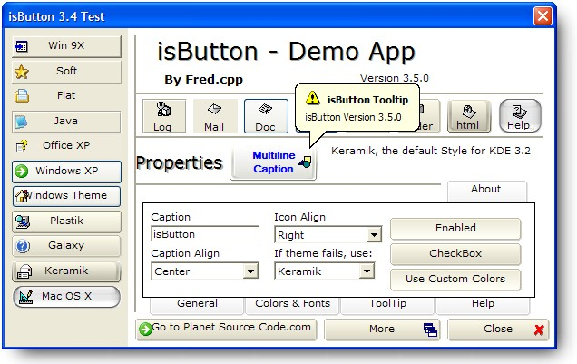



## isButton 3\.6\.2 the multi style button Updated 2005\-9\-16

### Description

isButton is an award winner button; is a single file usercontrol with various visual styles and with custom properties like text align, icon align, custom tooltips, and customizable colors.

This (hopefully) final update fixes the annoying bugs the version 3.0 had. Uses Paul Caton's self subclassing method. Grayscaled Icons when Disabled were added (thanks to Dennis (dvrdsr)) I Implemented also this feature for BMP Images used as icons, UseMaskColor and Mask color. Comments (and why not? votes) are wellcome. There is a ocx version on my home page ( http://mx.geocities.com/fred_cpp ) at the programming section.

----

Version 3.4.1 - Changes: Fixed Black BMP's when align &lt;&gt; Right; Removed picturebox pMask for temporal drawing(By teee_eeee); Support for custom Shapes By theme (Thanks to Dana Seaman)

----

Version 3.4.2 - Changes: Code Clean Up and Now Working Default and Cancel properties, Error Handling in all routines, fixed Keyboard events (All Done by Aldo Vargas)

----

Version 3.5.0 - Changes: Added Multiline Support For caption,Corrected Java Rects Added Custom Offset for text and Icons for each Style

----

2005-7-20 / Version 3.5.1 Added RightToLeft property (Still testing)

----

2005-7-28 / Version 3.6.0 Fixed CaptionAlign, Added Space Bar Support (Thanks to Jiri Novotny)

Now hover button doesn't bring to front the parent form :)

----

2005-7-29 / Version 3.6.1 Code Clean up! RightToLeft fixed?

Last Update: 2005-7-39

----

2005-7-29 / Version 3.6.2 A Fast Click detection bug Fixed.

Last Update: 2005-9-16
 
### More Info
 

             |
---                |---
**Submitted On**   |2005-09-16 11:21:04
**By**             |[Fred\.cpp](https://github.com/Planet-Source-Code/PSCIndex/blob/master/ByAuthor/fred-cpp.md)
**Level**          |Advanced
**User Rating**    |5.0 (368 globes from 74 users)
**Compatibility**  |VB 6\.0
**Category**       |[Custom Controls/ Forms/  Menus](https://github.com/Planet-Source-Code/PSCIndex/blob/master/ByCategory/custom-controls-forms-menus__1-4.md)
**World**          |[Visual Basic](https://github.com/Planet-Source-Code/PSCIndex/blob/master/ByWorld/visual-basic.md)
**Archive File**   |[isButton\_31933159162005\.zip](https://github.com/Planet-Source-Code/fred-cpp-isbutton-3-6-2-the-multi-style-button-updated-2005-9-16__1-61476/archive/master.zip)

### API Declarations

Tons

